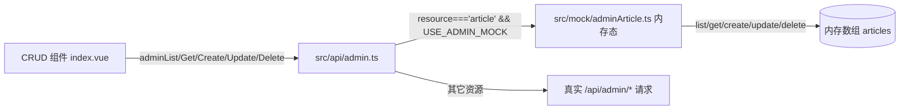

## 用户需求

后台「文章列表」CRUD 改用前端编造数据、不调用后端接口；并优化其编辑弹窗界面。

## 产品概述

后台管理端的「文章列表」（通用 CRUD 视图 `src/views/admin/crud/index.vue`）当前直接调用后端。本次将其改为：仅 `article` 资源走前端内存态 mock（其余 21 个资源仍调真实接口），使在无后端环境下也能演示文章的新增/编辑/删除；同时改造编辑弹窗的视觉与交互布局。

## 核心功能

- 后台文章列表 / 详情 / 新增 / 编辑 / 删除全部走本地 mock，不发起 `/api/admin/article*` 请求；会话内内存态增删改查，保存/删除后列表即时反映。
- 编辑弹窗字段分区分组：分为「基础信息」与「正文内容」两组。
- 正文内容区采用 Markdown 编辑器 + 实时预览侧边分屏（等高、各自内部滚动、带「编辑 / 预览」小标签）。
- 弹窗内容区可滚动、高度受控（长表单不撑破视口，页脚固定）。

## 技术栈

- 前端框架：Vue 3 + TypeScript（项目现有）
- UI 组件库：Element Plus（项目现有）
- 状态/请求：Pinia + 自建 `service` 请求封装（项目现有）
- Markdown 编辑器：md-editor-v3（上一任务已安装）
- 构建校验：`vue-tsc` 类型检查 + `vite build`

## 实现方案

### 总体策略

沿用前台 `src/store/articles.ts` 已有的 `USE_LOCAL_MOCK` 开关范式，在后台通用 CRUD 的 API 层（`src/api/admin.ts`）注入一个仅作用于 `article` 资源的 mock 分支；mock 数据以内存数组承载，提供与真实接口同签名的异步函数，实现会话内可见的增删改查。UI 层保持对 `adminList/adminGet/adminCreate/adminUpdate/adminDelete` 的调用不变，仅数据源在 API 层被替换，从而对 21 个通用资源零侵入。

### 关键技术决策

1. **Mock 注入点选在 API 层而非组件层**：与现有前台 mock 范式一致，组件逻辑无需感知数据源切换；仅 `resource === 'article'` 走 mock，其余资源保持原样，避免影响其它后台表。
2. **内存态 CRUD**：`create` 用自增/时间戳生成新 id；`update` 按 id 替换；`delete` 按 id 过滤。返回 `Promise`（微任务延迟模拟异步），保证 `onMounted`/保存流程的代码路径与真实接口一致。
3. **字段分区用 `section` 元数据驱动**：在 `FieldSchema` 增加可选 `section`，schema 为 article 字段标注「基础信息 / 正文内容」，表单渲染时按 section 变化插入分隔标题，避免写死分组、保持通用 CRUD 的可扩展性。
4. **弹窗分屏与滚动**：Markdown 分支保留左右分屏（编辑器 + `MdPreview` 实时预览），统一高度（约 380px）、各自内部滚动；表单整体包入可滚动容器（`max-height: 68vh`）使页脚固定、长表单不溢出。深色主题沿用已有 `mdTheme` 绑定 `appStore.isDark`。

### 性能与可靠性

- mock 数据为小数组（2~3 条），无网络开销，列表/详情均为 O(n) 本地检索，性能无忧。
- 所有 mock 函数返回 Promise，错误路径与真实接口一致（组件 `try/catch` 已处理空数组兜底）。
- 不改动其它资源与接口契约，blast radius 仅限 article 的本地数据来源与弹窗展示。

## 实现要点（执行细节）

- 复用 `src/mock/article.ts` 的字段命名风格，但后台 article schema 为扁平字段（`id/category/link/cover_image/publish_date/sort/status/remark/content`），mock 直接按扁平结构构造，含一条含中英文 Markdown 示例的 `content`。
- `src/api/admin.ts` 顶部加 `const USE_ADMIN_MOCK = true` 并注释「接入后端后删除」；五个 `admin*` 函数开头统一判断 `if (USE_ADMIN_MOCK && resource === 'article') return mockX(...)`。
- 分区分隔符用 `el-divider`（`content-position="left"`），首个字段前也渲染其所属分区分隔标题。
- 保留已有 `MdEditor/MdPreview`、深色 `theme` 绑定、`destroy-on-close`，仅调整 `dialogWidth`（含 markdown 时约 1080px）与分屏高度/滚动。

## 架构设计



## 目录结构

```
src/
├── mock/
│   └── adminArticle.ts        # [NEW] 后台文章内存态 mock：articles 数组 + list/get/create/update/delete 异步函数，含 2~3 条扁平字段编造数据（含 content Markdown 示例）
├── api/
│   └── admin.ts               # [MODIFY] 新增 USE_ADMIN_MOCK 开关；admin* 函数在 article 资源时改走 mock 分支，其余保持真实请求
├── views/admin/crud/
│   ├── types.ts               # [MODIFY] FieldSchema 增加可选 section?: string
│   ├── schema.ts              # [MODIFY] article 各字段标注 section：基础信息 / 正文内容
│   └── index.vue              # [MODIFY] 表单渲染按 section 插入 el-divider；细化 Markdown 分屏高度/滚动/标签；表单包入可滚动容器控制弹窗高度；dialogWidth 调整
```

## 关键代码结构

```ts
// src/mock/adminArticle.ts
export interface AdminArticle {
  id: string
  category: string
  link: string
  cover_image: string
  publish_date: string
  sort: string
  status: string
  remark: string
  content: string
}
export const mockAdminArticles: AdminArticle[]
export function mockAdminList(): Promise<AdminArticle[]>
export function mockAdminGet(id: string): Promise<AdminArticle>
export function mockAdminCreate(body: Record<string, any>): Promise<AdminArticle>
export function mockAdminUpdate(id: string, body: Record<string, any>): Promise<AdminArticle>
export function mockAdminDelete(id: string): Promise<void>

// src/views/admin/crud/types.ts
export interface FieldSchema {
  key: string
  label: string
  type: FieldType
  table?: boolean
  form?: boolean
  width?: number
  required?: boolean
  options?: FieldOption[]
  section?: string   // 新增：用于编辑弹窗字段分区
}
```

## 设计风格

沿用后台现有中性浅/深色风格（灰阶为主、圆角卡片、细边框），对编辑弹窗做结构化重构：将表单按「基础信息」「正文内容」两个分区用左对齐分隔线分组；正文区采用左右等高的分屏卡片——左侧 Markdown 编辑器、右侧实时预览，各自带「编辑 / 预览」小标签与独立滚动条；整个表单置于可滚动内容区（max-height 约 68vh），底部操作按钮固定，长表单不撑破视口。深色模式下边框、底色与预览区背景同步切换。

## 页面区块（编辑弹窗）

- 弹窗头部：标题（新增/编辑 - 文章列表）+ 关闭按钮。
- 分区一「基础信息」：id、分类、链接、封面、发布日期、排序、状态、备注，按现有控件渲染。
- 分区二「正文内容」：Markdown 编辑器 + 右侧实时预览，左右分屏、等高 380px、各带小标签、独立滚动。
- 弹窗底部：取消 / 保存（固定，不随内容滚动）。