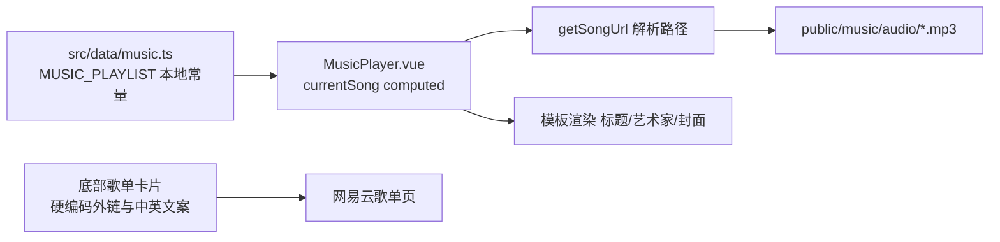

## 产品概述

访客端音乐播放器（`MusicPlayer.vue`）此前在「c84781e 增加前后端对接」中被改为从后端 `/api/music/playlist` 拉取歌单，同时删除了本地歌单数据文件。用户认为改动后效果不如从前，要求把播放器恢复到该提交之前的版本：使用本地内置歌单，不再请求后端播放列表接口。

## 核心功能

1. **本地歌单恢复**：重建 `src/data/music.ts`，内置 4 首歌曲（标题、艺术家、封面、音频路径），作为播放器唯一数据源。
2. **播放器数据源回退**：`MusicPlayer.vue` 改为使用本地 `MUSIC_PLAYLIST`，移除对 `siteStore.playlist` 的依赖。
3. **底部歌单卡片回退**：恢复为固定的网易云歌单外链与内置中英文文案（不再由 `/api/site/config` 的 `musicPlaylistLink` 驱动）。
4. **停止后端播放列表请求**：不再调用 `/api/music/playlist`，清理随之失效的调用链。

## 边界

- 只回退访客端播放器；后台「音乐列表」管理页、后端 `/api/admin/music`、`/api/music/playlist` 接口本身均**不动**。
- `/api/site/config` 请求**保留**（站点导航、页脚、文案仍依赖它），仅播放器不再用其中的 `musicPlaylistLink` 渲染卡片。
- 不做后台音乐改回通用 CRUD、不隐藏后台音乐菜单。


## 技术栈

沿用现有项目栈：Vue 3 + TypeScript + Element Plus + Pinia + Vite。数据由本地 TS 常量提供，无新增依赖。

## 实现思路

以「恢复本地歌单数据文件 + 逐处回退播放器改动 + 清理失效调用链」三段式还原到 c84781e 之前的行为。核心是**不直接 `git checkout` 旧文件**：c84781e 同时重命名了 `public/music` 下的音频与封面（如 `Vallès - Pirene's Fountain.mp3` → `pirene.mp3`），旧数据文件中的路径已全部失效，必须按当前资源文件名重写，否则 4 首歌全部 404。

**关键技术决策**：

1. **重写而非检出 `src/data/music.ts`**：旧文件引用的是重命名前的长文件名（含空格、特殊字符），当前 `public/music` 只有 `island / lofi / pirene / updater` 四组文件。按新文件名重建可保证立即可播放，同时短文件名也更利于 URL 编码安全。
2. **播放器回退粒度控制在 c84781e 的改动范围内**：只回退该提交引入的 7 处改动（可选链、`playlistLink` 卡片、import、`currentSong`/`getSongUrl`/`handleNext`/`handlePrev`），不触碰该提交之后其他提交对播放器的任何修改。
3. **回退后列表恒非空**：本地歌单是编译期常量，因此 `currentSong` 不再需要 `?? null` 兜底，`getSongUrl` 不需要 null 守卫，`handleNext`/`handlePrev` 不需要空列表判断——这些防御代码随数据源回退一并移除，避免留下无意义分支。
4. **最小化爆破半径**：仅删除确无其他引用的 `getPlaylist` 调用链；`musicPlaylistLink`（来自 `/api/site/config`）保留在 store 中，因为它是站点配置的自然映射，删除收益低且 config 仍被其他模块使用。

## 实现要点（防回归）

- **文件名映射必须正确**：local-01 → `pirene`，local-02 → `lofi`，local-03 → `island`，local-04 → `updater`；音频在 `/music/audio/`，封面在 `/music/covers/`，均以 `/` 开头（播放器 `getSongUrl` 会规范化为 `/music/...`）。
- **移除失效 import**：回退后 `MusicPlayer.vue` 不再需要 `useSiteStore` 与 `pickText`，必须一并删除，避免未使用变量告警。
- **旧版卡片文案就地判断语言**：用 `appStore.language === 'zh' ? ... : ...`，不依赖 `pickText`。
- **确认无残留引用**：`siteStore.playlist` 当前仅被 `MusicPlayer.vue` 使用；`getPlaylist()` 仅被 `src/store/site.ts` 使用。删除前需再次核实（如 `SongVo` 类型是否被 `api/types.ts` 之外引用）。
- **public 资源不动**：回退不涉及任何 public 文件改名或删除。

## 架构设计

回退后数据流向为纯前端：`src/data/music.ts`（编译期常量）→ `MusicPlayer.vue` 的 `currentSong` computed → `getSongUrl()` 解析为 `/music/audio/*.mp3` → `<audio>` 元素直接加载本地静态资源。播放器与 Pinia 的 `siteStore` 解耦，不再参与任何播放列表网络请求。



## 目录结构

```
d:/lzkgit/my_blog_/src/
├── data/
│   └── music.ts              # [NEW] 恢复本地歌单数据。导出 Song 接口与 MUSIC_PLAYLIST（4 首）。
│                             #       路径必须使用当前资源名：/music/audio/{pirene,lofi,island,updater}.mp3
│                             #       与 /music/covers/{pirene,lofi,island,updater}.jpg
├── components/
│   └── MusicPlayer.vue       # [MODIFY] 回退 7 处改动：import 改回 MUSIC_PLAYLIST；
│                             #          currentSong 用 MUSIC_PLAYLIST[idx]；模板去掉 ?. 可选链；
│                             #          底部卡片恢复硬编码网易云链接与中英文案；
│                             #          getSongUrl 签名回到 typeof currentSong.value 并去掉 null 守卫；
│                             #          handleNext/handlePrev 回到 MUSIC_PLAYLIST.length 并去掉空列表判断；
│                             #          移除 useSiteStore / pickText import 与 playlist、playlistLink 两个 computed
├── App.vue                   # [MODIFY] 移除 siteStore.loadPlaylist() 调用（停止 /api/music/playlist 请求）
├── store/
│   └── site.ts               # [MODIFY] 移除 playlist ref、loadPlaylist() 及 getPlaylist 导入；
│                             #          musicPlaylistLink 保留（站点配置映射，config 仍被导航/页脚使用）
└── api/
    ├── music.ts              # [DELETE] getPlaylist() 已无调用方
    └── index.ts              # [MODIFY] 移除 './music' 导出（若 SongVo 无其他引用则一并清理）
```

## 关键代码结构

```ts
// src/data/music.ts —— 恢复的本地歌单（路径对齐当前 public 资源）
export interface Song {
  id: string
  title: string
  artist: string
  cover: string
  audio: string
}

export const MUSIC_PLAYLIST: Song[] = [
  // id: 'local-01' -> pirene    | "Pirene's Fountain" / Vallès
  // id: 'local-02' -> lofi      | 'Sleepless nights - lofi hiphop mix pt.2' / Mixed Artists
  // id: 'local-03' -> island    | 'Island' / Nujabes/Uyama Hiroto/Haruka Nakamura
  // id: 'local-04' -> updater   | 'the updater' / TSUTCHIE
]
```

```ts
// MusicPlayer.vue —— 回退后的关键契约
const currentSong = computed(() => MUSIC_PLAYLIST[currentSongIndex.value])
function getSongUrl(song: typeof currentSong.value, isCover = false): string
```


## Agent Extensions

### SubAgent
- **code-explorer**
  - Purpose: 在清理阶段核实 `MUSIC_PLAYLIST`、`getPlaylist`、`siteStore.playlist`、`SongVo`、`musicPlaylistLink` 的全部引用点，确认删除 `src/api/music.ts` 与 store 中 `loadPlaylist` 不会造成悬空引用
  - Expected outcome: 输出完整引用清单，确认除 MusicPlayer.vue 与 store/site.ts 外无其他调用方，方可安全删除

### Skill
- **lsp-code-analysis**
  - Purpose: 用语义级「查找引用 / 定义跳转」复核 `getPlaylist` 与 `SongVo` 的引用，避免仅靠文本搜索漏掉别名导入或重导出场景
  - Expected outcome: 确认待删除符号零引用或仅剩自身定义，删除后 `vue-tsc` 无报错
