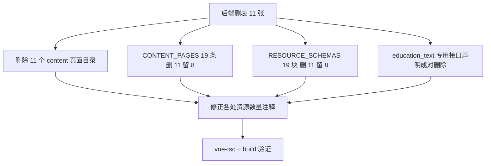

## 需求概述
后端已删除以下业务表：project_i18n、project_tag、project_award、project_gallery，以及教育管理与竞赛相关表（education_text、experience、experience_i18n、honor、honor_i18n、competition、competition_award）。前端管理控制台需同步清理这些资源的页面、注册、字段配置与接口声明，使前端与后端表结构保持一致。

## 范围边界
- 仅清理 **admin 控制台**相关代码
- 不动访客端前台：PortfolioGrid.vue、api/project.ts、api/types.ts 的 gallery/galleryCount/awards 等公开接口结构保持原样
- 不动后端（用户自行处理）

## 核心变更
1. 删除 11 个内容管理页面目录（views/admin/content/ 下）
2. 从 CONTENT_PAGES 注册表移除 11 条，保留 8 条
3. 从通用 CRUD 字段配置移除 11 个资源块，保留 8 个
4. 成对移除 education_text 的专用接口声明（含其 VO 类型）
5. 修正各处「资源数量」注释，避免与实际不符造成误导


## 技术栈
Vue 3.4（script setup + TypeScript）+ Pinia + Vue Router 4 + Vite 5 + Element Plus。校验命令：`npx vue-tsc --noEmit -p tsconfig.json` 与 `npm run build`（`vue-tsc && vite build`），当前均通过。

## 实现方案

**策略：按「页面目录 → 注册表 → 字段配置 → 接口声明 → 注释」顺序清理，每步成对删除，避免悬空引用。** 页面目录与 CONTENT_PAGES 条目必须成对删除（页面靠 lazy import 字符串引用，无静态 import）；schema 配置块与专用接口声明独立删除，不产生编译期引用。

### 清理范围



### 关键技术决策

- **页面目录与注册表成对删除**：content 页面由 `CONTENT_PAGES` 按后端菜单 perms 字符串 lazy import，无静态 import；只删一侧会造成 lazy import 指向不存在的文件（构建报错）或留下死页面。
- **education_text 专用接口三处必须成对删除**：`DedicatedResource = keyof AdminVoMap` 是从 `AdminVoMap` 派生的类型，而 `DEDICATED_RESOURCES` 只是 `as const` 字面量数组，TS 不校验两者一致性。若只删其一，会造成类型守卫宣称 `education_text` 是专用资源、但 `AdminVoMap['education_text']` 不存在的隐藏类型脱节。三处（数组条目、AdminVoMap key、AdminEducationTextVo 接口）全删后，推导自动收缩为 5 个 key，编译无错。
- **保留兜底机制**：`CONTENT_PAGES[resource] ?? crud/index.vue` 与 `resolveIcon` 的 `'Menu'` 兜底均保留。若后端仍下发已删资源的菜单，会回退到通用 CRUD 页，此时 schema 为 undefined；已确认 crud/index.vue 全程使用 `schema.value?.fields` / `schema?.title` 可选链，不会崩溃，仅渲染空表格。属可接受兜底，无需新增代码，但需提醒后端同步摘除菜单。
- **保留仍在使用的辅助符号**：schema.ts 的 `STATUS`、`LANG`、`autoId`、`strId`、`SCHEMA_MAP`（reduce 自动生成）均有保留资源在用，不可删。
- **ICON_MAP 不动**：其键是 `el-icon-*` 图标名而非资源名，与本次删表无关。

## 目录结构

```
src/
├── config/adminPages.ts              # [MODIFY] CONTENT_PAGES 删 11 条（project_i18n/project_tag/
│                                     #  project_award/project_gallery/education_text/experience/
│                                     #  experience_i18n/honor/honor_i18n/competition/competition_award）；
│                                     #  移除空的分组注释「教育 / 经历」「荣誉 / 竞赛」；修正末项逗号与数量注释
├── views/admin/content/              # [DELETE] 11 个目录：projectI18n、projectTag、projectAward、
│                                     #  projectGallery、educationText、experience、experienceI18n、
│                                     #  honor、honorI18n、competition、competitionAward
│                                     #  [KEEP] 8 个：siteText、nav、hero、project、projectCategory、
│                                     #  article、articleCategory、articleI18n
├── views/admin/crud/
│   ├── schema.ts                     # [MODIFY] RESOURCE_SCHEMAS 删 11 个配置块（含其 // N 标题 注释），
│   │                                 #  保留 8 块；修正文件头「21 个后台资源」与 datetime 注释
│   └── types.ts                      # [MODIFY] 仅修正注释「21 个资源」→ 8
├── api/
│   ├── adminResource.ts              # [MODIFY] DEDICATED_RESOURCES 移除 'education_text'；修正数量注释
│   ├── adminTypes.ts                 # [MODIFY] AdminVoMap 移除 education_text；删除 AdminEducationTextVo；
│   │                                 #  修正「7 个专用接口」「这 6 个 VO」注释
│   └── admin.ts                      # [MODIFY] 仅修正注释「21 张业务表」→ 8、「6 个资源」→ 5
├── router/index.ts                   # [MODIFY] 仅修正注释「19 个页面」→ 8
└── views/admin/crud/index.vue        # [MODIFY] 仅修正注释「7 个专用资源」→ 5
```

## 执行注意事项

1. **逐块删除 schema 配置时包含其上一行的序号注释**（如 `// 5 作品多语`），否则留下孤立的编号注释。
2. **CONTENT_PAGES 删除后处理逗号**：最后一个保留条目不得有行尾逗号；空的分组注释需一并移除。
3. **删除专用接口三处必须成对**，顺序建议：`AdminVoMap` key → `AdminEducationTextVo` 接口 → `DEDICATED_RESOURCES` 条目，每删一处即确认无残留引用。
4. **不触碰访客端**：`api/types.ts` 的 `gallery` / `galleryCount` / `awards`、`api/project.ts` 的 `withGallery` 属前台公开接口，本次不动。
5. **注释同步**：数量类注释（19/21/7/6）需统一改为实际值（页面 8、专用资源 5），否则后续维护会被误导。
6. **每批删除后跑一次 `vue-tsc --noEmit`**，最后跑 `npm run build` 做完整验证，确保 lazy import 无悬空、类型推导正常。

## 可选顺带清理（非本次引入）
`views/admin/crud/types.ts` 的 `FieldType` 成员 `'datetime'` 在整个 schema 中无任何字段使用，仅 crud/index.vue 保留渲染分支。可保留（作为未来扩展类型）或一并清理，需用户确认后再动。


## Agent Extensions

### SubAgent
- **code-explorer**
  - Purpose：删除 11 个页面目录与 schema 配置块后，全项目复核这些资源名字符串（下划线资源名 + 驼峰目录名）是否还有残留引用
  - Expected outcome：输出「零残留」结论或列出遗漏位置，确保 lazy import 无悬空

### Skill
- **lsp-code-analysis**
  - Purpose：对 `AdminEducationTextVo`、`AdminVoMap`、`DEDICATED_RESOURCES`、`DedicatedResource` 做语义级 find-references，确认专用接口三处成对删除后类型推导无脱节
  - Expected outcome：拿到权威引用计数，确认 `isDedicatedResource` 与 `adminResourceList/Get/Create/Update/Delete` 的 `AdminVoMap[R]` 索引类型仍成立
